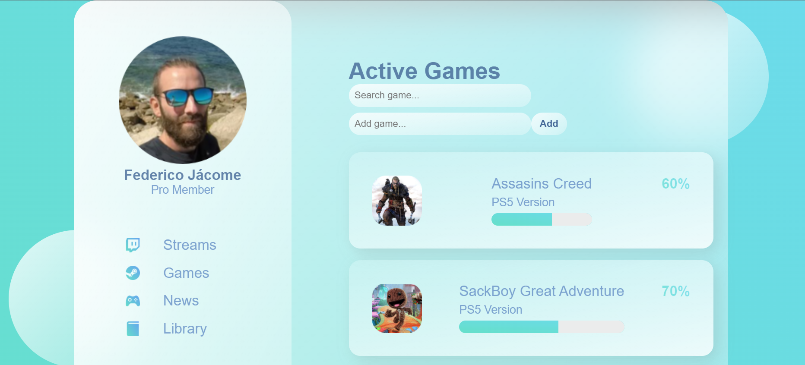

# Glass App

---

### Description
A very simple, little logic app made in angular to show a list of product and use a search on them. the UI was made following this great HTML CSS course.

[Dev Ed - Build Glass Website with HTML and CSS Tutorial.](https://www.youtube.com/watch?v=O7WbVj5apxU&ab_channel=DevEd)

---

## Use

To run the angular application you need to run npm install to get the needed packages and ng serve -o to run it in a local server.

---

## Technologies

- HTML CSS
- Angular
- Type Script

---
## Author Info

- Linkedin - [Federico Andrés Jácome Castañeda](https://www.linkedin.com/in/federicojacome/)
- Website - [Portfolio](http://fedeandresdeveloper.online/)

[Back To The Top](#read-me-template)
